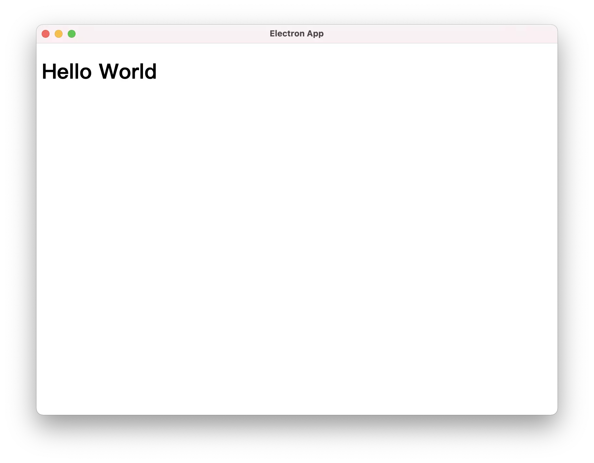

**elecrun** is a tool to run your electron app easily.

[](https://github.com/jctaoo/elecrun/actions/workflows/CI.yml)

## Features

- Write modern JavaScript, [TypeScript](https://www.typescriptlang.org/) in [Node.js](https://nodejs.org/en/) with no config.

- Let [Electron](https://www.electronjs.org/) work with any front-end framework.

- Using [esbuild](https://esbuild.github.io/) to transform your main process code, It's very fast ⚡️.

- Using [vite](https://vitejs.dev/) in renderer process.

## Quick Start

### Installation

- Globally install

```shell
# using npm
npm install -g elecrun
# using yarn
yarn global add elecrun
```

- Install as devDependencies

```shell
# using npm
npm install elecrun --save-dev
# using yarn
yarn global add elecrun --dev
```

### Create & Run electron app

#### Start a new project

```shell
# create project directory
mkdir my-electron-app && cd my-electron-app
# initialize your project
yarn init -y
# install electron as dependencies
yarn add electron -D
```

#### Write your `main process` code in `TypeScript` (JavaScript is also ok)

index.ts

```ts
import { app, BrowserWindow } from 'electron';

function createWindow() {
  const win = new BrowserWindow({
    width: 800,
    height: 600,
  });
  win.loadURL('http://localhost:3000');
}

app.whenReady().then(createWindow);
```

> For more information about Electron, see [electron doc](https://www.electronjs.org/docs)

#### Write your `renderer process` code in `TypeScript`.

> Actually, you can use any front-end framework supported by `vite` here. In a simple project, let's use a single html file.

index.html

```html
<!DOCTYPE html>
<html lang='en'>
<head>
  <meta charset='UTF-8' />
  <title>Electron App</title>
</head>
<body>
<h1>Hello World</h1>
</body>
</html>
```

#### Add a script in `package.json`.

```json
{
  "scripts": {
    "dev": "elecrun --vite"
  }
}
```

> `elecrun` is alias of `elecrun`

#### ⚡️ Start your electron app

```shell
yarn dev
```

<center> <br> <br> <div style="color:orange; border-bottom: 1px solid #d9d9d9; display: inline-block; color: #999; padding: 2px;">screen shot</div> <br></center>

#### Source codes

- https://github.com/jctaoo/elecrun/tree/main/fixtures/demo
- https://github.com/jctaoo/elecrun/tree/main/fixtures/simple

## How it works

### Renderer Process

`elecrun` using `vite` to handle code in renderer process.

The entry file is `index.html` in `root directory`(You can specify the root directory path, see [options --vite](#options---vite-renderer-root)) and vite using [esm](https://developer.mozilla.org/docs/Web/JavaScript/Guide/Modules) to struct your renderer process code.

Vite also provides a dev server support `Hot Module Replacement`. It's means your code changes can always be displayed on the interface.

> From vite official website : A dev server that provides rich feature enhancements over native ES modules, for example extremely fast Hot Module Replacement (HMR).

For more information, see [vite official website](https://vitejs.dev)

### Main Process

`elecrun` using `esbuild` to transform your code may cannot directly run in nodejs such as TypeScript and modern JavaScript to the code nodejs can handle. Besides, `elecrun` also bundle your code to one file.

When you run `elecrun dev`, `elecrun` will try to find and read entry file(You can specify the entry file path, see [development phase](#development-phase)) then statically analyze to transform your code. After that, save the target code to your `node_modules/.elecrun` (there is one exception, see [options --preload](#options---preload-file)). Finally, `elecrun` will execute `electron` command line tool to start your app.

When your main process code has been changed, `elecrun` will ask if you want to rerun your app. This is useful when you don’t want to interrupt the current debugging.

## Guide

### development phase

run

```shell
elecrun dev --vite
# or 
elecrun --vite
```

The full version of dev command is `elecrun [file-entry] [options]`. The only argument is `file-entry` that indicates the path of entry script for main process. You can specify this or `elecrun` will automatically find the entry script path by the following list:

- ./src/main/index.js
- ./src/main/index.ts
- ./src/index.js
- ./src/index.ts
- ./index.js
- ./index.ts

example:

```shell
elecrun dev ./main.ts
```

#### options `--vite [renderer root]`

The option `--vite` means run vite server with `elecrun`. If you don't want using `vite`, just remove this option.

The 'renderer root' is the root directory for vite. You can specify this or `elecrun`
will automatically find the root directory by the following list:

- ./src/renderer/
- ./src/
- ./

example:

```shell
elecrun dev --vite ./src
```

#### options `--preload <file>`

When you enable `contextIsolation`, you may need `preload` (You can find in [BrowserWindow options](https://www.electronjs.org/docs/api/browser-window#browserwindow)). But Electron loads your preload script based on string variable. It's means `esbuild` cannot statically analyze the location of preload script or bundle it. The solution is to provide an option `--preload` to specify location of preload script. Then, `elecrun` just transform it and save preload code's target code in the same path as bundled code.

The parameter `<file>` should be set as preload script path relative to the main src. Example:

```
+-src
|--+-main
|  |---index.ts
|  |---preaload.ts
|--+-renderer
|  |---index.html
|--package.json
```

run

```shell
elecrun --vite --preload preload.ts
```

#### option `--clean-cache`

`dev` command save the build artifact to `node_modules/.elecrun/app` under your project by default. But sometimes you want to clean these files. This options help you clean cache files when you run `dev` command.

#### options `--esm`

The `--esm` option is used to specify whether to use ESM modules to run the main process code. By default, `elecrun` uses `commonjs` modules to run the main process code. If you want to use ESM modules, just add this option.

> Some third-party libraries only support `esm` modules. When using such third-party libraries, you may need to add this option.

### build phase

The build phase is almost the same as the development phase (also including all the options and arguments except `--vite`). The difference is that the compiled files are stored in `node_modules` in the development phase, while the build phase is stored in the app directory.

### clean output

run `elecrun clean` to easily clean output by `elecrun`
